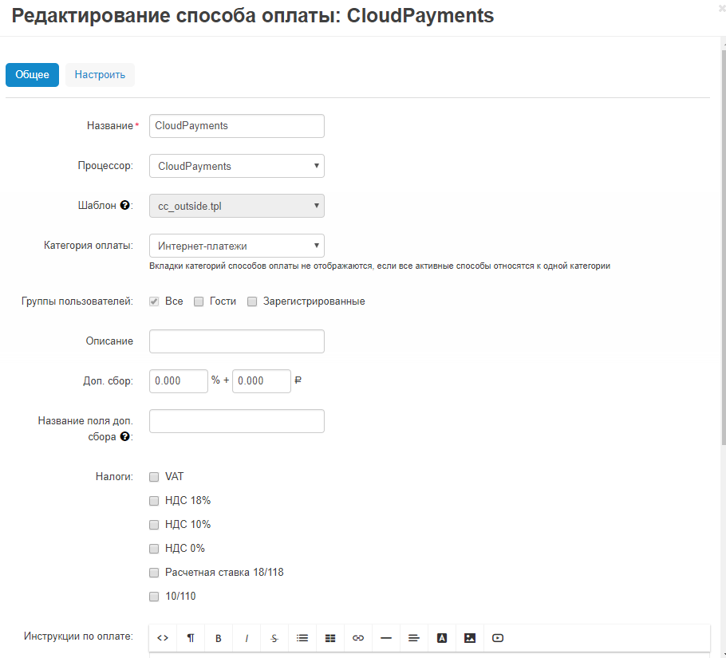
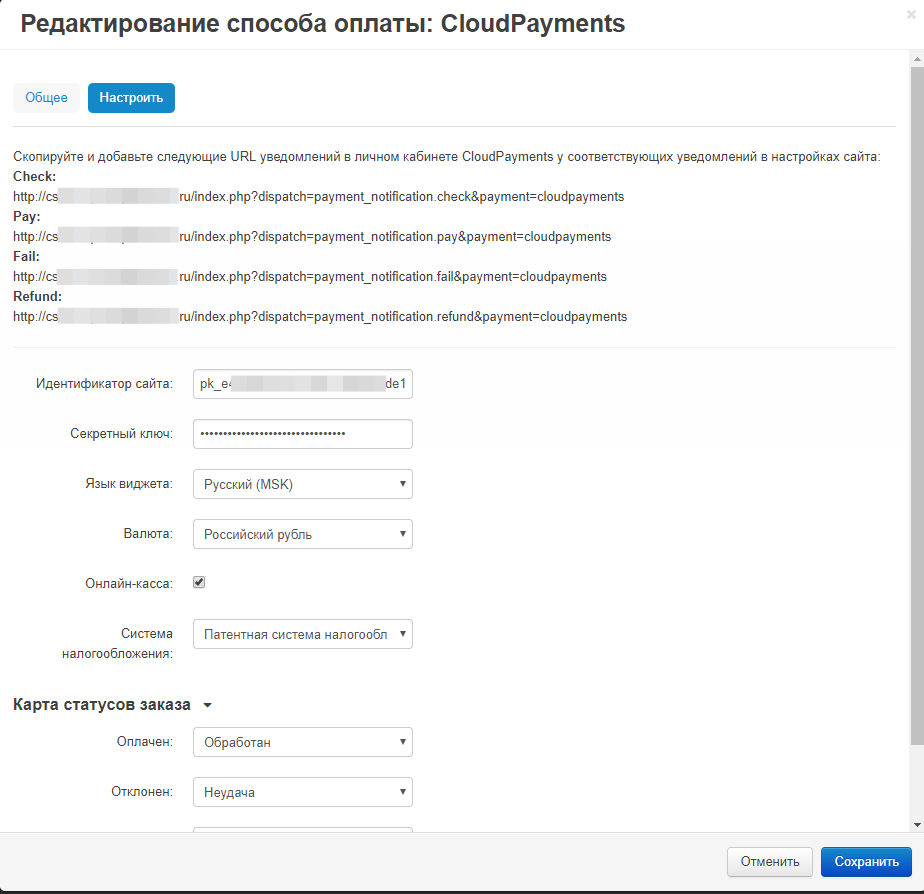
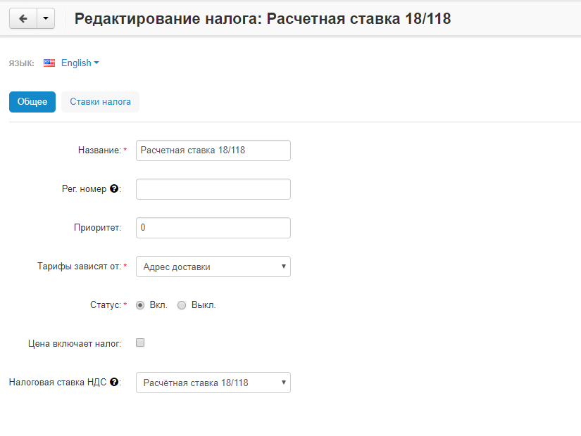
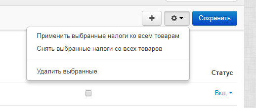

Модуль позволит с легкостью добавить на ваш сайт оплату банковскими картами через платежный сервис [CloudPayments](https://cloudpayments.ru).
Порядок регистрация сайта описан в документации CloudPayments https://cloudpayments.ru/integration

### Возможности:  
• Одностадийная схема оплаты;  
• Двухстадийная схема оплаты;  
• Выбор дизайн виджета;  
• Поддержка онлайн-касс (ФЗ-54);  
• Отправка чеков по email;  
• Отправка чеков по SMS;  
• Отдельная настройка НДС для доставки;

### Совместимость
• CSCart v.4.7.x и выше;

# Техническая настройка
## Личный кабинет CloudPayments
В личном кабинете CloudPayments в настройках сайта необходимо включить следующие уведомления:

* **Запрос на проверку платежа** (Сheck):\
https://domain.ru/index.php?dispatch=payment_notification.check&payment=cloudpayments
* **Уведомление о принятом платеже** (Pay):\
https://domain.ru/index.php?dispatch=payment_notification.pay&payment=cloudpayments
* **Уведомление при отклоненном платеже* (Fail):\
https://domain.ru/index.php?dispatch=payment_notification.fail&payment=cloudpayments
* **Уведомление о подтверждении платежа** (Сonfirm):\
https://domain.ru/index.php?dispatch=payment_notification.confirm&payment=cloudpayments
* **Уведомление об отменене платежа** (Сancel):\
https://domain.ru/index.php?dispatch=payment_notification.cancel&payment=cloudpayments
* **Уведомление о возврате платежа* (Refund):\
https://domain.ru/index.php?dispatch=payment_notification.refund&payment=cloudpayments

Где domain.ru — доменное имя вашего сайта.
Во всех случаях требуется выбирать вариант по умолчанию: кодировка — UTF-8, HTTP-метод — POST, формат — CloudPayments
Данные URL можно скопировать из настройки модуля CloudPayments в панели администрирования CS-Cart

## Установка модуля
1. Разархивируйте модуль и скопируйте содержимое папки upload в корень сайта
2. В разделе "Модули" -> "Управление модулями" перейдите на вкладку "Посмотреть все доступные модули"
3. Найдите в списке модуль "CloudPayments" и установите его 
4. В разделе "Администрирование" -> "Способы оплаты" добавьте новый метод оплаты и укажите следующие параметры:

### Вкладка "Общее"
* **Процессор** — Необходимо выбрать CloudPayments

### Вкладка "Настроить"
* **Идентификатор сайта** — Public id сайта из личного кабинета CloudPayments
* **Секретный ключ** — API Secret из личного кабинета CloudPayments
* **Язык виджета** — Язык интерфейса виджета
* **Валюта виджета** — Валюта в которой будет происходить оплата

#### При использовании интеграции с онлайн-кассой
* **Онлайн-касса** — Включение/отключение формирования онлайн-чека при оплате
* **Система налогообложения** — Тип системы налогообложения. Возможные значения перечислены в документации CloudPayments https://cloudpayments.ru/Docs/Directory#taxation-system

Значение НДС для товаров и доставки определяется из настроек товара и доставки соответственно.

#### Карта статусов
* **Оплачен** — Статус, на который требуется перевести заказ при принятом платеже
* **Отклонен** — Статус, на который требуется перевести заказ при отклоненном платеже
* **Возвращен** — Статус, на который требуется перевести заказ при возврате платежа

Вы можете добавить новый статус, при необходимости, в "Администрирование" -> "Статусы заказов"

После указания всех данных сохранить настройки.

## Добавление налоговой ставки НДС
Добавить новую налоговую ставку НДС можно в разделе "Администрирование" -> "Доставка и налоги" -> "Налоги"
Обязательно нужно выбрать "Налоговая ставка НДС" в соответствующем поле и на вкладке "Ставки налога" указать стоимость для всех регионов

Также возможно назначить в данном разделе налоговую ставку для всех товаров 

#### Changelog

= 1.3 =
* Добавлена фискализация для Узбекистана

= 1.2 =
* Исправлена проблема обработчика pay уведомления, при повторной попытке оплаты
* Исправлена проблема обработчика check уведомления, когда до оплаты был изменен состав заказа
* Исправлена проблема редиректа при оплате по сценарию оплаты по телефону (сценарий в магазине)
* Приведено в порядок список url для колбеков, а так же если включен протокол ssl будет url с https

= 1.1 =
* добавление двухстадийной схемы оплаты;  
* добавление выбора дизайна виджета;  
* правка значений ставок НДС;

= 1.0 =
* Публикация модуля.

